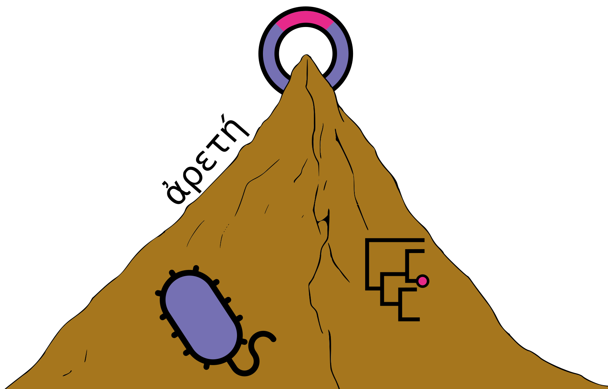

<!--[](https://github.com/fmaguire/arete/actions?query=workflow%3A%22nf-core+CI%22)-->
<!--[](https://github.com/fmaguire/arete/actions?query=workflow%3A%22nf-core+linting%22)-->
<!--[](https://doi.org/10.5281/zenodo.XXXXXXX)-->

[](https://www.nextflow.io/)
[](https://docs.conda.io/en/latest/)
[](https://www.docker.com/)
[](https://sylabs.io/docs/)




## Introduction

<!-- TODO nf-core: Write a 1-2 sentence summary of what data the pipeline is for and what it does -->
**ARETE** is a bioinformatics best-practice analysis pipeline for AMR/VF LGT-focused bacterial genomics workflow.

The pipeline is built using [Nextflow](https://www.nextflow.io), a workflow tool to run tasks across multiple compute infrastructures in a very portable manner. It uses Docker / Singularity containers making installation trivial and results highly reproducible.
Like other workflow languages it provides [useful features](https://www.nextflow.io/docs/latest/getstarted.html#modify-and-resume) like `-resume` to only rerun tasks that haven't already been completed (e.g., allowing editing of inputs/tasks and recovery from crashes without a full re-run).
The [nf-core](https://nf-cor.re) project provided overall project template, pre-written software modules when available, and general best practice recommendations.

<!-- TODO nf-core: Add full-sized test dataset and amend the paragraph below if applicable 
On release, automated continuous integration tests run the pipeline on a full-sized dataset on the AWS cloud infrastructure. This ensures that the pipeline runs on AWS, has sensible resource allocation defaults set to run on real-world datasets, and permits the persistent storage of results to benchmark between pipeline releases and other analysis sources. -->

## Pipeline summary

<!-- TODO nf-core: Fill in short bullet-pointed list of the default steps in the pipeline -->

Read processing:
1. Raw Read QC ([`FastQC`](https://www.bioinformatics.babraham.ac.uk/projects/fastqc/))
2. Read Trimming ([`fastp`](https://github.com/OpenGene/fastp))
3. Trimmed Read QC ([`FastQC`](https://www.bioinformatics.babraham.ac.uk/projects/fastqc/))
4. Taxonomic Profiling ([`kraken2`](http://ccb.jhu.edu/software/kraken2/))

Assembly:
1. Unicycler ([`unicycler`](https://github.com/rrwick/Unicycler))
2. QUAST QC ([`quast`](http://quast.sourceforge.net/))
3. CheckM QC (['checkm`](https://github.com/Ecogenomics/CheckM))

Annotation:
1. Prokka ([`prokka`](https://github.com/tseemann/prokka))
2. AMR ([`RGI`](https://github.com/arpcard/rgi))
3. Plasmids ([`mob_suite`](https://github.com/phac-nml/mob-suite))
4. CAZY, VFDB, and BacMet query using DIAMOND ([`diamond`](https://github.com/bbuchfink/diamond))

Phylogeny:
1. Roary ([`roary`](https://sanger-pathogens.github.io/Roary/))
2. IQTree ([`iqtree`](http://www.iqtree.org/))

### Future Development Targets

A list in no particular order of outstanding development features, both in-progress and planned: 

- CI/CD testing of local modules and pipeline logic

- Sensible default QC parameters to allow automated end-to-end execution with little-to-no required user intervention

- Integration of additional tools and scripts:

1. Genomic island detection (e.g., IslandCompare)
2. Inference of recombination events (e.g. Gubbins, CFML)
3. Phylogenetic inference of lateral gene transfer events using [`rspr`](https://github.com/cwhidden/rspr)
4. Inference of concerted gain and loss of genes and mobile genetic elements using [`the Community Coevolution Model`](https://github.com/beiko-lab/evolCCM)
5. Partner applications for analysis and visualization of phylogenetic distributions of genes and MGEs and gene-order clustering.

## Quick Start

1. Install [`nextflow`](https://nf-co.re/usage/installation)

2. Install [`Docker`](https://www.docker.com), [`Singularity`](https://sylabs.io/guides/3.0/user-guide/installation.html), or, as a last resort, [`Conda`](https://conda.io/miniconda.html). Also ensure you have a working `curl` installed (should be present on almost all systems).

Note: this workflow should also support [`Podman`](https://podman.io/), [`Shifter`](https://nersc.gitlab.io/development/shifter/how-to-use/) or [`Charliecloud`](https://hpc.github.io/charliecloud/) execution for full pipeline reproducibility. We have minimized reliance on `conda` and suggest using it only as a last resort (see [docs](https://nf-co.re/usage/configuration#basic-configuration-profiles)). Configure `mail` on your system to send an email on workflow success/failure (without this you may get a small error at the end `Failed to invoke workflow.onComplete event handler` but this doesn't mean the workflow didn't finish successfully).

3. Download the pipeline and test with a `stub-run`. The `stub-run` will ensure that the pipeline is able to download and use containers as well as execute in the proper logic. 

    ```bash
    nextflow run arete/ --input_sample_table samplesheet.csv -profile <docker/singularity/conda> -stub-run
    ```

    * Please check [nf-core/configs](https://github.com/nf-core/configs#documentation) to see if a custom config file to run nf-core pipelines already exists for your Institute. If so, you can simply use `-profile <institute>` in your command. This will enable either `docker` or `singularity` and set the appropriate execution settings for your local compute environment.
    * If you are using `singularity` then the pipeline will auto-detect this and attempt to download the Singularity images directly as opposed to performing a conversion from Docker images. If you are persistently observing issues downloading Singularity images directly due to timeout or network issues then please use the `--singularity_pull_docker_container` parameter to pull and convert the Docker image instead.

4. Start running your own analysis (ideally using `-profile docker` or `-profile singularity` for stability)!

    ```bash
    nextflow run arete -profile <docker/singularity> --input_sample_table samplesheet.csv 
    ```
`samplesheet.csv` must be formatted `sample,fastq_1,fastq_2`


**Note**: If you get this error at the end ```Failed to invoke `workflow.onComplete` event handler``` it isn't a problem, it just means you don't have an sendmail configured and it can't send an email report saying it finished correctly i.e., its not that the workflow failed.

See [usage docs](docs/usage.md) for all of the available options when running the pipeline.

### Testing

To test the worklow on a minimal dataset you can use the test configuration:

    ```bash
    nextflow run arete -profile test,docker 
    ```

Due to download speed of the Kraken2 database and CAZY database this will take ~25 minutes. 
However to accelerate it you can download/cache the database files to a folder (e.g., `test/db_cache`) and provide a database cache parameter.

    ```bash
    nextflow run arete -profile test,docker --db_cache $PWD/test/db_cache
    ```

## Documentation

The ARETE pipeline comes with documentation about the pipeline: [usage](docs/usage.md) and [output](docs/output.md).

## Credits

ARETE was written by [Finlay Maguire](https://github.com/fmaguire) and is currently developed by [Alex Manuele](https://github.com/alexmanuele).

## Contributions and Support

<!--If you would like to contribute to this pipeline, please see the [contributing guidelines](.github/CONTRIBUTING.md).-->
Thank you for your interest in contributing to ARETE. We are currently in the process of formalizing contribution guidelines. In the meantime, please feel free to open an issue describing your suggested changes.


## Citations

<!-- TODO nf-core: Add citation for pipeline after first release. Uncomment lines below and update Zenodo doi and badge at the top of this file. -->
<!-- If you use  nf-core/arete for your analysis, please cite it using the following doi: [10.5281/zenodo.XXXXXX](https://doi.org/10.5281/zenodo.XXXXXX) -->

This pipeline uses code and infrastructure developed and maintained by the [nf-core](https://nf-co.re) initative, and reused here under the [MIT license](https://github.com/nf-core/tools/blob/master/LICENSE).

> The nf-core framework for community-curated bioinformatics pipelines.
>
> Philip Ewels, Alexander Peltzer, Sven Fillinger, Harshil Patel, Johannes Alneberg, Andreas Wilm, Maxime Ulysse Garcia, Paolo Di Tommaso & Sven Nahnsen.
>
> Nat Biotechnol. 2020 Feb 13. doi: 10.1038/s41587-020-0439-x.
>

In addition, references of tools and data used in this pipeline are as follows can be found in the [`CITATIONS.md`](CITATIONS.md) file.
