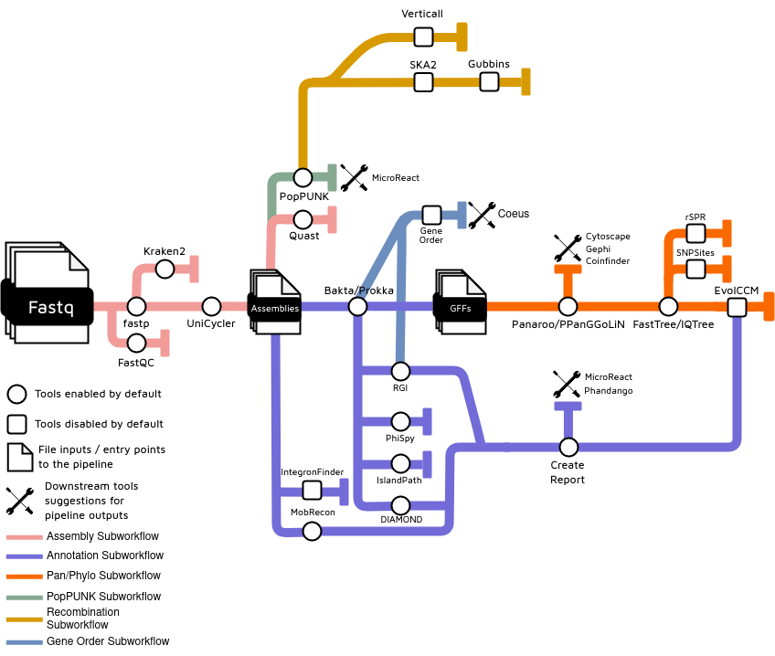

[](https://github.com/beiko-lab/arete/actions?query=workflow%3A%22nf-core+CI%22)
[](https://github.com/beiko-lab/arete/actions?query=workflow%3A%22nf-test+CI%22)
[](https://beiko-lab.github.io/arete/)

[](https://www.nextflow.io/)
[](https://www.docker.com/)
[](https://sylabs.io/docs/)


## What is ARETE?

**ARETE** (Antimicrobial Resistance: Emergence, Transmission, and Ecology) is a bioinformatics best-practice analysis pipeline for profiling the **genomic repertoire** and **evolutionary dynamics** of microorganisms with a particular focus on pathogens. We use ARETE to identify important genes (e.g., those that confer antimicrobial resistance or contribute to virulence) and mobile genetic elements such as plasmids and genomic islands, and infer important routes by which these are transmitted using evidence from recombination, cosegregation, coevolution, and phylogenetic trees comparisons.

ARETE produces a range of useful outputs (see [outputs](https://beiko-lab.github.io/arete/output/)), including those generated by each tool integrated into the pipeline, as well as summaries across the entire dataset such as phylogenetic profiles. Outputs from ARETE can also be easily fed into packages such as Coeus and MicroReact for further analyses. Although ARETE was primarily developed with pathogens in mind, inference of pan-genomes, mobilomes, and phylogenomic histories can be performed for any set of microbial genomes, with the proviso that reference databases are much more complete for some taxonomic groups than others. In general, the tools in ARETE work best at the species and genus level of relatedness.

A key design feature of ARETE is the versatility to find the right blend of software packages and parameter settings that best handle datasets of different sizes, introducing heuristics and swapping out tools as necessary. ARETE has been benchmarked on datasets from fewer than ten to over 10,000 genomes from a diversity of species and genera including _Enterococcus faecium_, _Escherichia coli_, _Listeria_, and _Salmonella_. Another key feature is enabling the user choice to run specific subsets of the pipeline; a user may already have assembled genomes, or they may not care about, say, recombination detection. There are also cases where it might be necessary to manually review the outputs from a particular step before moving on to the next one; ARETE makes this manual QC easy to do.

<picture>

  <source media="(prefers-color-scheme: dark)" srcset="./assets/arete.diagram.png">
  
</picture>

# Table of Contents

1. [About the pipeline](#about)
2. [Quick start](#quickstart)
3. [A couple of examples](#examples)
4. [Credits](#credits)
5. [Contributing to ARETE](#contributing)
6. [Citing ARETE](#citing)

## About the pipeline <a name="about"></a>

The pipeline is built using [Nextflow](https://www.nextflow.io), a workflow tool to run tasks across multiple compute infrastructures in a very portable manner. It uses Docker / Singularity containers making installation trivial and results highly reproducible.
Like other workflow languages it provides [useful features](https://www.nextflow.io/docs/latest/getstarted.html#modify-and-resume) like `-resume` to only rerun tasks that haven't already been completed (e.g., allowing editing of inputs/tasks and recovery from crashes without a full re-run).
The [nf-core](https://nf-cor.re) project provided overall project template, pre-written software modules when available, and general best-practice recommendations.

ARETE is organized as a series of subworkflows, each of which executes a different conceptual step of the pipeline. The subworkflow orgnaization provides suitable entry and exit points for users who want to run only a portion of the full pipeline.

### Genome subsetting

The user can optionally subdivide their set of genomes into related lineages identified by PopPUNK ([See documentation](https://beiko-lab.github.io/arete/subsampling/)). PopPUNK quickly assignes genomes to 'lineages' based on core and accessory genome identity. If this option is selected, all genomes will still be annotated, but cross-genome comparisons (e.g., pan-genome inference and phylogenomics) will use only a single representative genome from each lineage. The user can run PopPUNK with a spread of different thresholds and decide how to proceed based on the number of lineages produced and their own specific knowledge of the genetic population structure of the taxon being analyzed.

### Short-read processing and assembly

- Raw Read QC ([`FastQC`](https://www.bioinformatics.babraham.ac.uk/projects/fastqc/))
- Read Trimming ([`fastp`](https://github.com/OpenGene/fastp))
- Trimmed Read QC ([`FastQC`](https://www.bioinformatics.babraham.ac.uk/projects/fastqc/))
- Taxonomic Profiling ([`kraken2`](http://ccb.jhu.edu/software/kraken2/))
- Unicycler ([`unicycler`](https://github.com/rrwick/Unicycler))
- QUAST QC ([`quast`](http://quast.sourceforge.net/))
- CheckM QC ([`checkm`](https://github.com/Ecogenomics/CheckM))

### Annotation

- Genome annotation with Bakta ([`bakta`](https://github.com/oschwengers/bakta)) or Prokka ([`prokka`](https://github.com/tseemann/prokka))
- Feature prediction:

  - AMR genes with the Resistance Gene Identifier ([`RGI`](https://github.com/arpcard/rgi))
  - Plasmids with MOB-Suite ([`mob_suite`](https://github.com/phac-nml/mob-suite))
  - Genomic Islands with IslandPath ([`IslandPath`](https://github.com/brinkmanlab/islandpath))
  - Phages with PhiSpy ([`PhiSpy`](https://github.com/linsalrob/PhiSpy))
  - (_optionally_) Integrons with [`IntegronFinder`](https://github.com/gem-pasteur/Integron_Finder)
  - Specialized databases: CAZY, VFDB, BacMet and ICEberg2 using DIAMOND homology search ([`diamond`](https://github.com/bbuchfink/diamond))

### Phylogenomics

- (_optionally_) Genome subsetting with PopPUNK ([See documentation](https://beiko-lab.github.io/arete/subsampling/))
- Pan-genome inference using PPanGGOLiN ([`PPanGGOLiN`](https://github.com/labgem/PPanGGOLiN)) or Panaroo ([`panaroo`](https://github.com/gtonkinhill/panaroo))
- Reference and gene tree inference using FastTree ([`fasttree`](http://www.microbesonline.org/fasttree/)) or IQTree ([`iqtree`](http://www.iqtree.org/))
- (_optionally_) SNP-sites ([`SNPsites`](https://github.com/sanger-pathogens/snp-sites))

### Recombination detection

- Recombination detection is performed within lineages identified by PopPUNK ([`poppunk`](https://poppunk.net/)). Note that this application of PopPUNK is different from the subsetting described above.
- Genome alignment using SKA2 ([`ska2`](https://github.com/bacpop/ska.rust))
- Recombination detection using Verticall ([`verticall`](https://github.com/rrwick/Verticall/)) and/or Gubbins ([`gubbins`](https://github.com/nickjcroucher/gubbins))

### Coevolution

- Identification of coordinated gain and loss of features using EvolCCM ([`EvolCCM`](https://rdrr.io/github/beiko-lab/evolCCM/f/README.md))

### Lateral gene transfer

- Phylogenetic inference of LGT using rSPR ([`rSPR`](https://github.com/cwhidden/rspr))

### Gene order

- Comparison of genomic neighbourhoods using the Gene Order Workflow ([`Gene Order Workflow`](https://github.com/JTL-lab/Gene-Order-Workflow))

See our [roadmap](ROADMAP.md) for a full list of future development targets.

## Quick Start <a name="quickstart"></a>

1.  Install [`nextflow`](https://nf-co.re/usage/installation)

2.  Install [`Docker`](https://www.docker.com) or [`Singularity`](https://sylabs.io/guides/3.0/user-guide/installation.html). Also ensure you have a working `curl` installed (should be present on almost all systems).

    2.1. Note: this workflow should also support [`Podman`](https://podman.io/), [`Shifter`](https://nersc.gitlab.io/development/shifter/how-to-use/) or [`Charliecloud`](https://hpc.github.io/charliecloud/) execution for full pipeline reproducibility. Configure `mail` on your system to send an email on workflow success/failure (without this you may get a small error at the end `Failed to invoke workflow.onComplete event handler` but this doesn't mean the workflow didn't finish successfully).

3.  Download the pipeline and test with a `stub-run`. The `stub-run` will ensure that the pipeline is able to download and use containers as well as execute in the proper logic.

    ```
    nextflow run beiko-lab/ARETE -profile test,<docker/singularity> -stub-run
    ```

    3.1. Please check [nf-core/configs](https://github.com/nf-core/configs#documentation) to see if a custom config file to run nf-core pipelines already exists for your Institute. If so, you can simply use `-profile <institute>` in your command. This will enable either `docker` or `singularity` and set the appropriate execution settings for your local compute environment.

    3.2. If you are using `singularity` then the pipeline will auto-detect this and attempt to download the Singularity images directly as opposed to performing a conversion from Docker images. If you are persistently observing issues downloading Singularity images directly due to timeout or network issues then please use the `--singularity_pull_docker_container` parameter to pull and convert the Docker image instead.
    In case of input datasets larger than 100 samples, [check our resource profiles documentation](https://beiko-lab.github.io/arete/resource-profiles/), for optimal usage.

4.  Start running your own analysis (ideally using `-profile docker` or `-profile singularity` for stability)!

```bash
nextflow run beiko-lab/ARETE \
  -profile <docker/singularity> \
  --input_sample_table samplesheet.csv \
  --poppunk_model bgmm
```

`samplesheet.csv` must be formatted `sample,fastq_1,fastq_2`, with the first column being sample names and the other two corresponding to compressed FASTQ files.

**Note**: If you get this error at the end `` Failed to invoke `workflow.onComplete` event handler `` it isn't a problem, it just means you don't have an sendmail configured and it can't send an email report saying it finished correctly i.e., its not that the workflow failed.

See [usage docs](https://beiko-lab.github.io/arete/usage/) for all of the available options when running the pipeline.
See the [parameter docs](https://beiko-lab.github.io/arete/params/) for a list of all parameters currently implemented in the pipeline and which ones are required.
See the [FAQ](https://beiko-lab.github.io/arete/faq/) for a list of frequently asked questions and common issues.

### Testing

To test the worklow on a minimal dataset you can use the test configuration (with either docker or singularity - replace `docker` below as appropriate):

```bash
nextflow run beiko-lab/ARETE -profile test,docker
```

To accelerate it you can download/cache the database files to a folder (e.g., `test/db_cache`) and provide a database cache parameter.

```bash
nextflow run beiko-lab/ARETE \
  -profile test,docker \
  --db_cache $PWD/test/db_cache \
  --bakta_db $PWD/baktadb/db-light
```

We also provide a larger test dataset, under `-profile test_full`, for use in ARETE's `annotation` entry. This dataset is comprised of 8 bacterial genomes. As a note, **this can take upwards of 20 minutes to complete on an average personal computer**.
Replace `docker` below as appropriate.

```bash
nextflow run beiko-lab/ARETE -entry annotation -profile test_full,docker
```

## Examples <a name="examples"></a>

The fine details of how to run ARETE are described in the command reference and documentation, but here are a couple of illustrative examples of how runs can be adjusted to accommodate genome sets of different sizes:

### Assembly, annotation, and pan-genome inference from a modestly sized dataset (50 or so genomes) from paired-end reads

```bash
nextflow run beiko-lab/ARETE \
 --input_sample_table samplesheet.csv \
 --annotation_tools 'mobsuite,rgi,vfdb,bacmet,islandpath,phispy,report' \
 --poppunk_model bgmm \
 -profile docker
```

Parameters used:

- `--input_sample_table` - Input dataset in samplesheet format (See [usage](https://beiko-lab.github.io/arete/usage/#samplesheet-input))
- `--annotation_tools` - Select the annotation tools and modules to be executed (See the [parameter documentation](https://beiko-lab.github.io/arete/params/#annotation) for defaults)
- `--poppunk_model` - Model to be used by [PopPUNK](poppunk.readthedocs.io/)
- `-profile docker` - Run tools in docker containers.

### Annotation to evolutionary dynamics on 300-ish genomes

```bash
nextflow run beiko-lab/ARETE \
 --input_sample_table samplesheet.csv \
 --poppunk_model dbscan \
 --run_recombination \
 --run_gubbins \
 -entry annotation \
 -profile medium,docker
```

Parameters used:

- `--input_sample_table` - Input dataset in samplesheet format (See [usage](https://beiko-lab.github.io/arete/usage/#samplesheet-input))
- `--poppunk_model` - Model to be used by [PopPUNK](poppunk.readthedocs.io/).
- `--run_recombination` - Run the recombination subworkflow.
- `--run_gubbins` - Run [Gubbins](https://github.com/nickjcroucher/gubbins) as part of the recombination subworkflow.
- `--use_ppanggolin` - Use [PPanGGOLiN](https://github.com/labgem/PPanGGOLiN) for calculating the pangenome. Tends to perform better on larger input sets.
- `-entry annotation` - Run annotation subworkflow and further steps (See [usage](https://beiko-lab.github.io/arete/usage/)).
- `-profile medium,docker` - Run tools in docker containers. For `-profile medium`, check our [resource requirements documentation](https://beiko-lab.github.io/arete/resource_profiles/).

### Annotation to evolutionary dynamics on 10,000 genomes

```bash
nextflow run beiko-lab/ARETE \
 --input_sample_table samplesheet.csv \
 --poppunk_model dbscan \
 --run_recombination \
 -entry annotation \
 -profile large,docker
```

Parameters used:

- `--input_sample_table` - Input dataset in samplesheet format (See [usage](https://beiko-lab.github.io/arete/usage/#samplesheet-input))
- `--poppunk_model` - Model to be used by [PopPUNK](poppunk.readthedocs.io/).
- `--run_recombination` - Run the recombination subworkflow.
- `--use_ppanggolin` - Use [PPanGGOLiN](https://github.com/labgem/PPanGGOLiN) for calculating the pangenome. Tends to perform better on larger input sets.
- `--enable_subsetting` - Enable subsetting workflow based on genome similarity (See [subsetting documentation](https://beiko-lab.github.io/arete/subsampling/))
- `-entry annotation` - Run annotation subworkflow and further steps (See [usage](https://beiko-lab.github.io/arete/usage/)).
- `-profile large,docker` - Run tools in docker containers. For `-profile large`, check our [resource requirements documentation](https://beiko-lab.github.io/arete/resource_profiles/).

## Credits <a name="credits"></a>

The ARETE software was originally written and developed by [Finlay Maguire](https://github.com/fmaguire) and [Alex Manuele](https://github.com/alexmanuele), and is currently developed by [João Cavalcante](https://github.com/jvfe).

Rob Beiko is the PI of the ARETE project. The project Co-PI is Fiona Brinkman. Other project leads include Andrew MacArthur, Cedric Chauve, Chris Whidden, Gary van Domselaar, John Nash, Rahat Zaheer, and Tim McAllister.

Many students, postdocs, developers, and staff scientists have made invaluable contributions to the design and application of ARETE and its components, including Haley Sanderson, Kristen Gray, Julia Lewandowski, Chaoyue Liu, Kartik Kakadiya, Bryan Alcock, Amos Raphenya, Amjad Khan, Ryan Fink, Aniket Mane, Chandana Navanekere Rudrappa, Kyrylo Bessonov, James Robertson, Jee In Kim, and Nolan Woods.

ARETE development has been supported from many sources, including Genome Canada, ResearchNS, Genome Atlantic, Genome British Columbia, The Canadian Institutes for Health Research, The Natural Sciences and Engineering Research Council of Canada, and Dalhousie University's Faculty of Computer Science. We have received tremendous support from federal agencies, most notably the Public Health Agency of Canada and Agriculture / Agri-Food Canada.

## Contributing to ARETE <a name="contributing"></a>

<!--If you would like to contribute to this pipeline, please see the [contributing guidelines](.github/CONTRIBUTING.md).-->

Thank you for your interest in contributing to ARETE. We are currently in the process of formalizing contribution guidelines. In the meantime, please feel free to open an issue describing your suggested changes.

## Citing ARETE <a name="citing"></a>

Please cite the tools used in your ARETE run: A comprehensive list can be found in the [`CITATIONS.md`](CITATIONS.md) file.

An early version of ARETE was used for assembly and feature prediction in [the following paper](https://pubmed.ncbi.nlm.nih.gov/36129737/):

> Sanderson H, Gray KL, Manuele A, Maguire F, Khan A, Liu C, Navanekere Rudrappa C, Nash JHE, Robertson J, Bessonov K, Oloni M, Alcock BP, Raphenya AR, McAllister TA, Peacock SJ, Raven KE, Gouliouris T, McArthur AG, Brinkman FSL, Fink RC, Zaheer R, Beiko RG. Exploring the mobilome and resistome of Enterococcus faecium in a One Health context across two continents. Microb Genom. 2022 Sep;8(9):mgen000880. doi: 10.1099/mgen.0.000880. PMID: 36129737; PMCID: PMC9676038.

<!-- TODO nf-core: Add citation for pipeline after first release. Uncomment lines below and update Zenodo doi and badge at the top of this file. -->

This pipeline uses code and infrastructure developed and maintained by the [nf-core](https://nf-co.re) initative, and reused here under the [MIT license](https://github.com/nf-core/tools/blob/master/LICENSE).

> The nf-core framework for community-curated bioinformatics pipelines.
>
> Philip Ewels, Alexander Peltzer, Sven Fillinger, Harshil Patel, Johannes Alneberg, Andreas Wilm, Maxime Ulysse Garcia, Paolo Di Tommaso & Sven Nahnsen.
>
> Nat Biotechnol. 2020 Feb 13. doi: 10.1038/s41587-020-0439-x.
